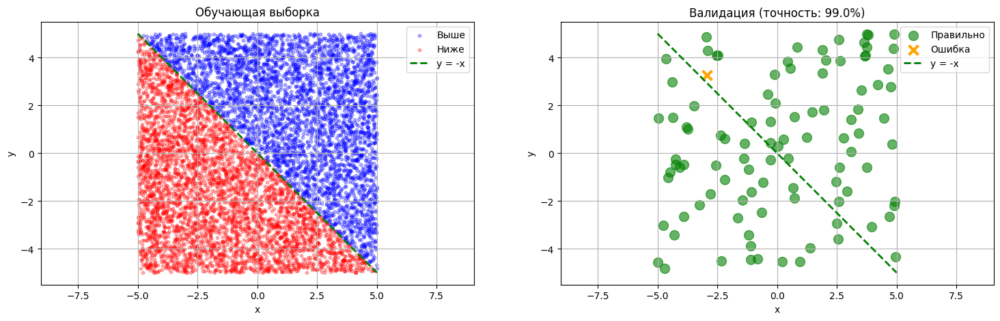
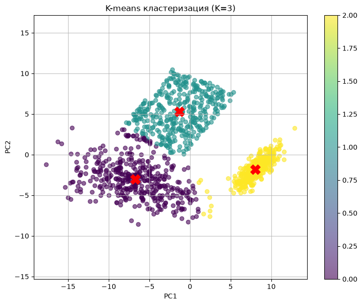

# numpy-neural-net

Нейронная сеть с вручную выведенным градиентом, снижение размерности методом главных компонент и кластеризация k-means — на чистом NumPy, без фреймворков глубокого обучения.

[](https://colab.research.google.com/github/yoonzky/numpy-neural-net/blob/main/three_neuron_net.ipynb)
[](https://colab.research.google.com/github/yoonzky/numpy-neural-net/blob/main/pca_kmeans.ipynb)

## three_neuron_net.ipynb

Сеть из трёх нейронов определяет, лежит ли точка выше прямой y = −x. Keras, TensorFlow и PyTorch по условию запрещены, разрешён только NumPy.

- Класс `SimpleNeuralNetwork` на четырёх скалярных весах: по одному на каждый нейрон первого слоя и два на выходной. Forward без матричного умножения — ровно по схеме из трёх нейронов.
- Градиент выведен вручную на бумаге и запрограммирован по формуле; сигмоида с `np.clip(z, -500, 500)` от переполнения.
- Обучающая выборка 8000 точек, валидирующая 100. Точность считается через таблицу TP, TN, FP, FN.
- Шаг обучения подобран перебором: шесть значений лямбда от 0,001 до 0,5 с выводом train accuracy, val accuracy и итогового лосса.

Основной прогон: **96,05 %** на обучающей выборке, **99 %** на валидации — ошибка в одной точке из ста, рядом с границей.



| Лямбда | 0,001 | 0,005 | 0,01 | 0,05 | 0,1 | 0,5 |
| --- | --- | --- | --- | --- | --- | --- |
| Train | 91,88 % | 94,55 % | 95,24 % | 97,71 % | 95,62 % | 26,97 % |
| Val | 96 % | 97 % | 98 % | **100 %** | 98 % | 24 % |

Лучший шаг — 0,05. При 0,5 обучение расходится: лосс с десятой эпохи и до конца стоит на 0,73, и сеть предсказывает хуже случайного.

## pca_kmeans.ipynb

- Три двумерных облака по 400 точек: два нормальных, одно равномерное.
- Расширение до пяти признаков: x3 = x1 + x2, x4 = ln(|x1| + 1) + x2, x5 = sin(x1·x2). Под логарифм идёт модуль плюс единица, иначе при отрицательных x1 он не определён.
- PCA снижает размерность обратно до двух, дальше k-means (`n_init='auto'`).
- Число кластеров проверяется по silhouette score перебором k от 2 до 7, для k от 2 до 5 строятся силуэтные диаграммы.

| k | 2 | 3 | 4 | 5 | 6 | 7 |
| --- | --- | --- | --- | --- | --- | --- |
| Silhouette | 0,523 | **0,595** | 0,561 | 0,546 | 0,531 | 0,506 |

Оптимум — три кластера, столько же, сколько исходных облаков.



## Запуск

```
pip install -r requirements.txt
jupyter notebook three_neuron_net.ipynb
```

## Стек

Python, NumPy, scikit-learn, Matplotlib.

Учебные проекты курса «Введение в разработку систем искусственного интеллекта», СПбГЭТУ «ЛЭТИ», 2025.
